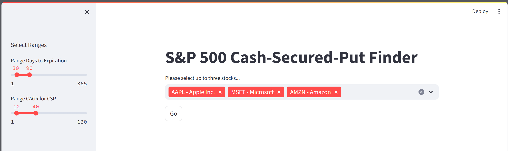
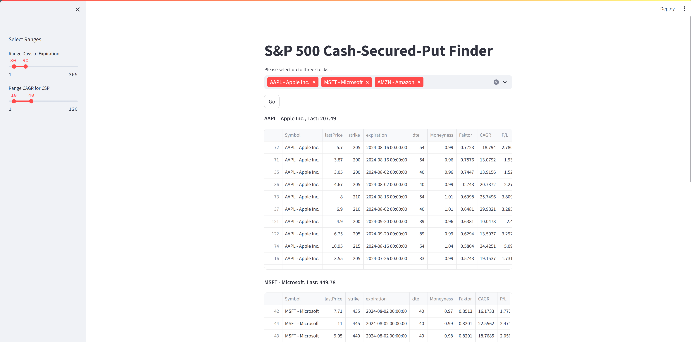

# S&P 500 CSP-Finder 🎯
Finde auf Knopfdurck Cash-Secured-Puts für Aktien aus dem S&P-500 Index, die am besten zu deiner Strategie passen.

## Überblick
Der **S&P 500 CSP-Finder** ist eine in Python und Streamlit entwickelte Anwendung, die Benutzern hilft, die besten Cash Secured Puts (CSPs) für bis zu drei ausgewählte Aktien aus dem S&P 500 Index zu finden. Anhand benutzerdefinierter Selektionskriterien wie der Laufzeit in Tagen und des CAGR (Compound Annual Growth Rate) werden die optimalen CSPs ermittelt und in übersichtlichen Tabellen präsentiert.

## Funktionen
- Auswahl von bis zu drei Aktien aus dem S&P 500 Index
- Festlegung benutzerdefinierter Selektionskriterien (z.B. Laufzeit in Tagen)
- Anzeige der besten CSPs basierend auf dem CAGR
- Präsentation der Ergebnisse in übersichtlichen Tabellen

## Anforderungen
- Python 3.x
- Streamlit
- Pandas
- Weitere Abhängigkeiten können der `requirements.txt` Datei entnommen werden

## Installation
1. **Repository klonen:**
    ```sh
    git clone https://github.com/eisi82/CSP-Finder.git
    cd CSP-Finder
    ```

2. **Virtuelle Umgebung erstellen und aktivieren:**
    ```sh
    python -m venv env
    source env/bin/activate  # Auf Windows: .\env\Scripts\activate
    ```

3. **Abhängigkeiten installieren:**
    ```sh
    pip install -r requirements.txt
    ```

## Nutzung
1. **Streamlit-Anwendung starten:**
    ```sh
    streamlit run app.py
    ```

2. **Aktien auswählen und Kriterien festlegen:**
    - Wähle bis zu drei Aktien aus dem S&P 500 Index.
    - Lege mit den Schiebereglern in der Seitenleiste die gewünschten Selektionskriterien fest (z.B. Laufzeit in Tagen).
    - Klicke auf "Go":
    

3. **Ergebnisse anzeigen:**
    - Die besten CSPs basierend auf dem CAGR werden in übersichtlichen Tabellen präsentiert.

## Beispiel
Hier ist ein Beispiel für die Nutzung der Anwendung:

1. Starte die Anwendung mit:
    ```sh
    streamlit run app.py
    ```

2. Wähle Aktien wie Apple (AAPL), Microsoft (MSFT) und Amazon (AMZN) aus und klicke auf "Go".



3. Lege die Laufzeit in Tagen fest und lasse die Anwendung die besten CSPs für dich finden.


## Beiträge
Beiträge sind willkommen! Wenn du Ideen hast oder Fehler findest, eröffne bitte ein Issue oder erstelle einen Pull Request.

## Lizenz
Dieses Projekt steht unter der Apache2-Lizenz. Siehe die [LICENSE](LICENSE) Datei für weitere Details.

## WICHTIGER RECHTLICHER HINWEIS / IMPORTANT LEGAL NOTICE
Diese App verwendet das Paket yfinance. Deshalb bitte folgenden Hinweis beachten:

Yahoo!, Y!Finance, and Yahoo! finance are registered trademarks of Yahoo, Inc.

yfinance is not affiliated, endorsed, or vetted by Yahoo, Inc. It's an open-source tool that uses Yahoo's publicly available APIs, and is intended for research and educational purposes.

You should refer to Yahoo!'s terms of use ([here](https://policies.yahoo.com/us/en/yahoo/terms/product-atos/apiforydn/index.htm), here, and here) for details on your rights to use the actual data downloaded. Remember - the Yahoo! finance API is intended for personal use only.

Deshalb die App bitte ausschließlich für persönliche, nichtkommerzielle, Zwecke im Einklang der Yahoo!-Nutzungsbedinungen nutzen!

## Autoren
- Roman Eisenbarth - eisi82(https://github.com/eisi82)

---

Vielen Dank fürs Ausprobieren des S&P 500 CSP-Finders! Wir freuen uns auf dein Feedback.

